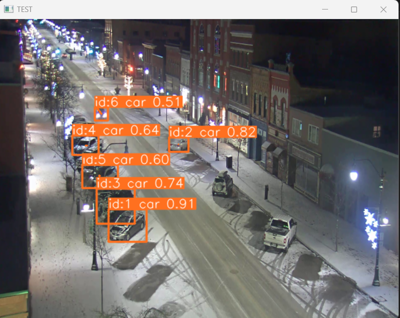

# Cars_Parking
A program used for detecting cars (other object also) with boundary constraint 

“Cars-park” is a project designed to detect cars and return a count of cars within a defined boundary. It uses a pre-trained YOLOv8 model for object detection and tracking. The process includes obtaining or training the model, making predictions, visualizing the predictions in real-time using a webcam, and processing the data. The implementation uses OpenCV (cv2) to handle video frames and create annotated windows. A unique tracking box is created for each object ID, and a rectangular detection box is used to count the objects. The project is based on Ultralytics’ ‘region-counter’ example.

